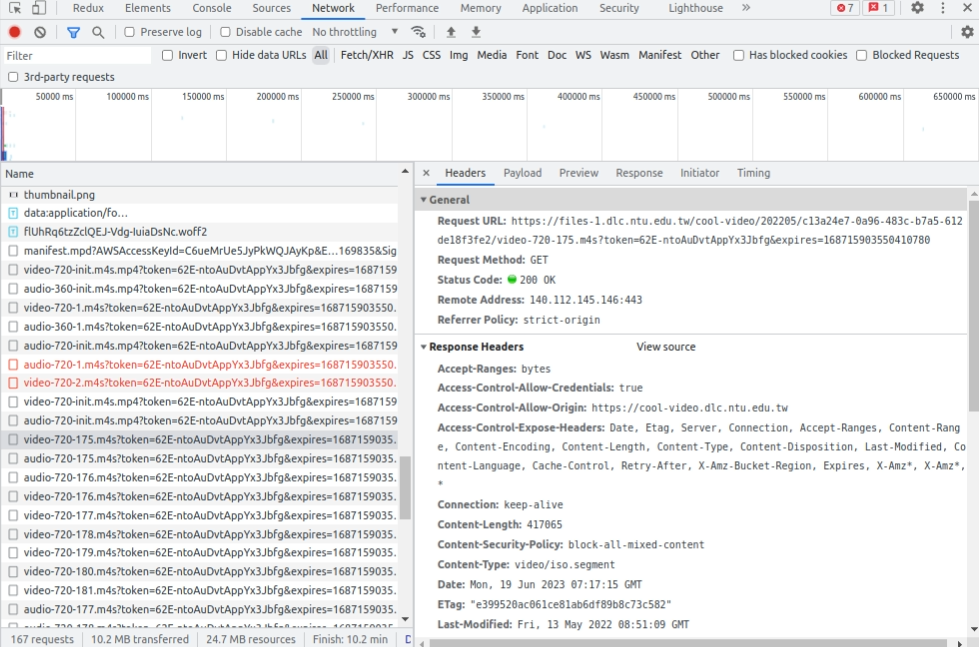
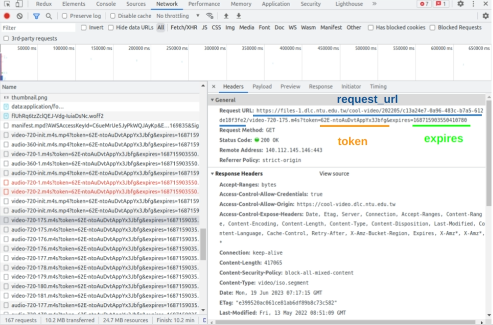
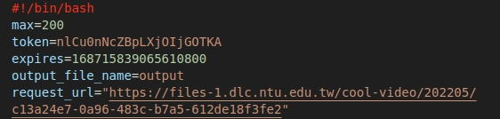

# A simple download video tool for NTU cool
In the new NTU cool, video and audio will be sliced to about 100 to 300 numbers of patches. This tool will help you download and merge all these patches into a single .mp4 file.

## Quick Start 
Open developer tools (Ctrl + Shift + i), and switch the tab to "Network". While you click the video play button, you can find multiple video and audio requests like the image below.


And in Header you can find ```token```, ```expires```, ```request_url``` in **Request URL** 


Fill these parameters to downloader.sh


And start downloading video by 
```bash 
sh ./Download
```

That's all! Please give me a star if you like this tool :)